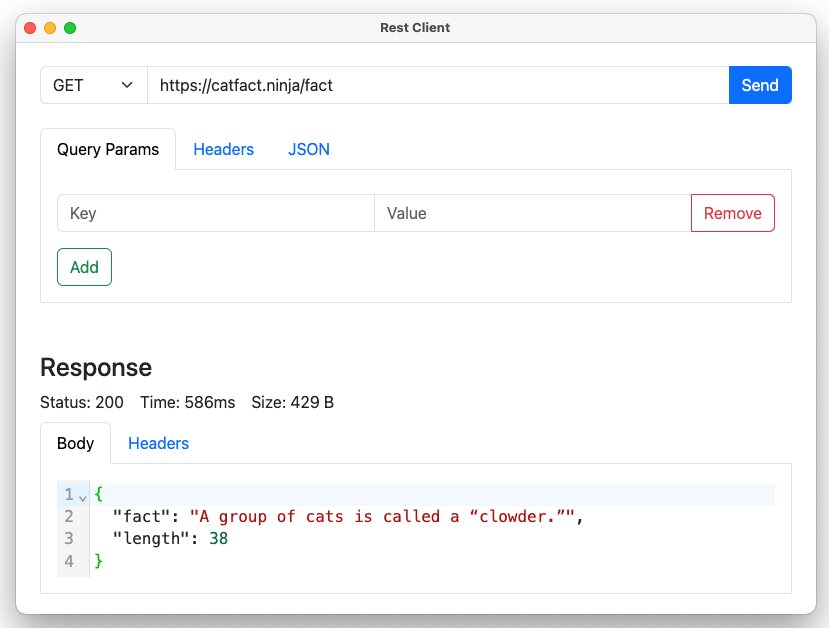

# Rest Client

This is a simple REST client that can be used to make HTTP requests to a server. It is built with Electron and Angular to provide a simple and easy to use interface.



## Features

- Send GET, POST, PUT, DELETE requests
- Add headers and body to requests
- View response headers and body
- Show performance metrics for requests

## Installation

The generated executable are quite large so I encourage you to build the client from source. Just follow the instructions below.

### Building from source

To build the client from source, clone the repository and run the following commands:

1. Clone the repository

```bash
git clone https://github.com/dikayx/rest-client && cd rest-client
```

2. Install dependencies

```bash
npm i
```

3. Build the client

```bash
npm run electron-build
```

_Verify the app is working and close it using `Ctrl+C` in the terminal._

4. Compile the executable for your platform

```bash
npm run make
```

The executable will be located in the `out/rest-client-<platform>-<arch>/` directory.

## Usage

To use the client, enter the URL of the server you want to make a request to. Select the request type from the dropdown and add any headers or body you want to send. Click the "Send" button to make the request. The response will be displayed in the "Response" tab below.

## License

This project is licensed under the MIT License - see the [LICENSE](LICENSE) file for details.

## Acknowledgements

The original idea for this project comes from WebDevSimplified's [postman-clone](https://github.com/WebDevSimplified/postman-clone). I used his project as a starting point to create a desktop application with Electron and Angular.
